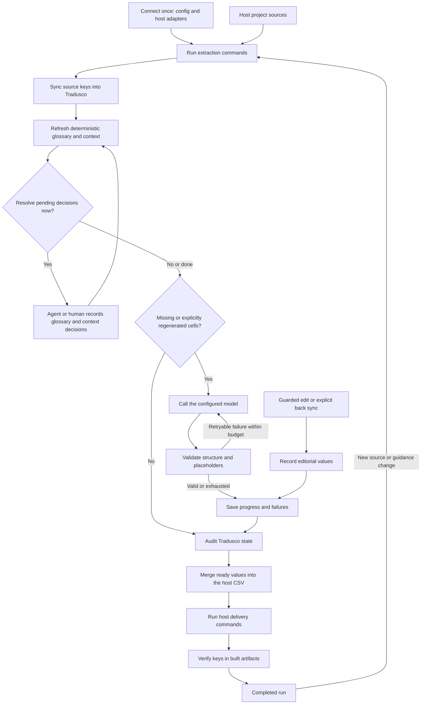
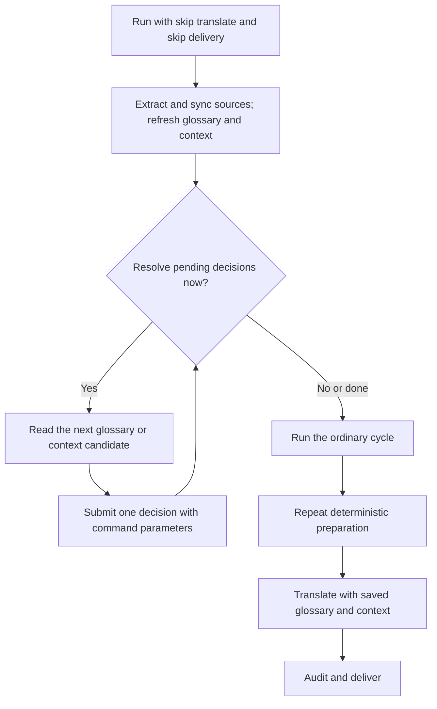

# Tradusco integration guide

This document describes the workflow implemented in the current repository. A
host project keeps its own source readers, product knowledge, catalogs and build
commands. Tradusco owns preparation, source-key selection, model calls,
validation, persisted translation state, guarded editorial changes and delivery
coordination.

Tradusco currently identifies a message by its exact base-language text. An `id`
column may be preserved in CSV, but it is not the translation-memory key.

## Current workflow



The decision commands and the ordinary runner are separate today. The runner
refreshes deterministic provider output and consumes decisions already recorded
in project files. It does not call `next` or `submit`, wait for an agent, or make
product decisions by itself. Missing optional glossary or context guidance does
not block translation.

## Files and ownership

The host repository normally contains both an integration configuration and a
Tradusco state directory:

```text
your-project/
  locale_src/
    translations.csv
  scripts/
    context-provider.js
  .tradusco/
    config.json
    app/
      config.json              # internal engine configuration
      translations.csv
      glossary.json
      contexts.json
      not_terms.json
      deferred_terms.json
      terms_queue.json
      editorial.json
      fr/
        progress.json
        failures.jsonl
```

| File | Writer | Meaning |
| --- | --- | --- |
| `.tradusco/config.json` | Host project | Commands, paths, locales and model policy |
| Host `sourceCsv` | Host extractor and Tradusco export | Interchange table between the host and Tradusco |
| `<projectDir>/translations.csv` | Tradusco | Working snapshot reconstructed from live source keys and progress |
| `<locale>/progress.json` | Tradusco | Persisted translations keyed by exact source text |
| `<locale>/failures.jsonl` | Tradusco | Append-only technical failure records |
| `<projectDir>/editorial.json` | Guarded edit and back-sync | Explicit editorial values that model regeneration must preserve |
| `<projectDir>/glossary.json` | Provider and decision commands | Generated terms and accepted terminology decisions consumed by translation |
| `<projectDir>/contexts.json` | Context decisions | Accepted manual context |
| `<projectDir>/not_terms.json` | Glossary decisions | Rejected terminology candidates |
| `<projectDir>/deferred_terms.json` | Glossary decisions | Candidates deliberately postponed pending evidence or authority |
| `<projectDir>/terms_queue.json` | Context decisions | Terminology candidates sent from context for glossary resolution |

`progress.json` is saved before the working CSV. If the CSV write fails, the
next translation run reconstructs it from progress without another model call.
An editorial record is authoritative for the same source key and repairs
progress and CSV if an earlier guarded write was interrupted.

## Integration configuration

The runner reads `.tradusco/config.json`. Relative paths and commands are resolved
from the directory containing that file.
For a new host repository, [`tradusco-init`](skills/tradusco-init/SKILL.md)
creates the initial config after the host interchange CSV exists and prepares
project-specific adapters.

```json
{
  "traduscoRoot": "/path/to/tradusco",
  "projectDir": "app",
  "sourceCsv": "../locale_src/translations.csv",
  "baseCol": "en",
  "locales": ["fr", "de", "ja"],
  "envFile": "../.env.tradusco",
  "extractCommands": [["node", "../scripts/extract-translations.js"]],
  "glossarySourceCommand": ["node", "../scripts/build-glossary.js"],
  "contextProviderFile": "../scripts/context-provider.js",
  "translate": {
    "model": "google/gemini-2.5-flash",
    "method": "auto",
    "batchSize": 50,
    "batchMaxInputTokens": 65536,
    "requestTimeout": 120,
    "retries": 3,
    "delaySeconds": 1,
    "referenceLangs": ["fr"],
    "protectLangs": ["fr"]
  },
  "deliveryCommands": [["node", "../scripts/apply-and-build-translations.js"]],
  "artifactKeysCommand": ["node", "../scripts/list-built-translation-keys.js"]
}
```

All commands are argv arrays; shell syntax is not interpreted.
The complete field and flag reference is in
[CONFIGURATION.md](CONFIGURATION.md).

Tradusco's mutable state defaults to `projectDir`: `glossary.json`,
`contexts.json`, `not_terms.json`, `deferred_terms.json`, `terms_queue.json`,
`editorial.json`, the working CSV and per-locale progress. Project source data
and provider code stay outside `.tradusco/` because the host project owns them.

- `extractCommands` must produce `sourceCsv`.
- `glossarySourceCommand` receives an appended `--output PATH` and must write a
  JSON object containing generated term entries.
- `contextProviderFile` is a CommonJS provider described in
  [CONTEXT.md](CONTEXT.md).
- `deliveryCommands` must apply exported values to the real host catalogs and
  build them. Tradusco does not infer the host catalog format.
- `artifactKeysCommand`, when configured, must print a JSON array of source keys
  present in the final built artifacts. A missing `sourceCsv` key fails delivery.
- `translate.protectLangs` lists reviewed locales that `--regenerate` must not
  overwrite. It does not prevent ordinary translation of new source keys.

The runner creates `<projectDir>/config.json`; it is internal state rather than a
second integration configuration to maintain by hand.

## Connecting existing state

Do not start with the full runner when the host CSV already contains translations
that are absent from `progress.json`. Sync reconstructs the working CSV from
progress; it does not infer whether a host value is reviewed, automatic or stale.

First create the internal snapshot:

```bash
TRADUSCO_ROOT=/path/to/tradusco
PYTHON="$TRADUSCO_ROOT/.venv/bin/python"

$PYTHON "$TRADUSCO_ROOT/sync_project_from_csv.py" \
  --project-dir .tradusco/app \
  --source-csv locale_src/translations.csv \
  --base-col en
```

Then choose how known values enter Tradusco:

- seed known automatic translation memory with `--bootstrap-from` or existing
  `progress.json` files;
- import known editorial host values with an explicit back-sync preview and
  write;
- leave values of unknown origin untouched until their ownership is resolved.

Do not translate or deliver that unresolved scope: the host CSV preserves an
unknown value only until Tradusco has a ready managed replacement for it.

Back-sync records every imported difference as editorial, so it must not be used
as a blanket import for values that are merely assumed to be machine output.

```bash
$PYTHON "$TRADUSCO_ROOT/review_translations.py" back-sync \
  --config .tradusco/config.json

$PYTHON "$TRADUSCO_ROOT/review_translations.py" back-sync \
  --config .tradusco/config.json \
  --write \
  --expect REVISION_FROM_PREVIEW
```

The revision covers both the host CSV and the working CSV. A concurrent change
causes the write to fail instead of overwriting it.

## Preparing glossary and context decisions

The host project supplies facts; Tradusco supplies the common queues and command
protocol. A normal run automatically refreshes the deterministic glossary and
context, then uses their saved decisions in translation. It cannot decide product
meaning, so resolving new candidates remains an optional explicit loop.

For a new project or a large source update, use this sequence:



The preparation pass makes no model call and does not update host catalogs:

```bash
node "$TRADUSCO_ROOT/tools/run.js" \
  --config .tradusco/config.json \
  --skip-translate \
  --skip-delivery
```

Inspect glossary state and one pending candidate:

```bash
node "$TRADUSCO_ROOT/tools/glossary.js" report --config .tradusco/config.json
node "$TRADUSCO_ROOT/tools/glossary.js" next --config .tradusco/config.json
```

Accept a term and provide its reviewed translations:

```bash
node "$TRADUSCO_ROOT/tools/glossary.js" submit \
  --config .tradusco/config.json \
  --term Oblivion \
  --mode stem \
  --note "Name of a place." \
  --translation "fr=Oubli" \
  --translation "de=Vergessenheit"
```

Reject a candidate that is not a product term:

```bash
node "$TRADUSCO_ROOT/tools/glossary.js" submit \
  --config .tradusco/config.json \
  --term Weapon \
  --reject "Generic word in this project."
```

Defer a candidate when the available evidence or authority is insufficient:

```bash
node "$TRADUSCO_ROOT/tools/glossary.js" submit \
  --config .tradusco/config.json \
  --term Sanctuary \
  --defer "Needs a product naming decision."
```

Inspect unresolved context groups and record an answer:

```bash
node "$TRADUSCO_ROOT/tools/context.js" report --config .tradusco/config.json
node "$TRADUSCO_ROOT/tools/context.js" next --config .tradusco/config.json
node "$TRADUSCO_ROOT/tools/context.js" submit \
  --config .tradusco/config.json \
  --group src/ui.js \
  --source Mystery \
  --context "Label for an unknown reward."
```

Use `--needs-glossary` instead of `--context` when the source needs a terminology
decision. It enters the shared terminology queue. `--json` remains available on
both submit commands for batch input. Accepted decisions are used on the next
provider refresh. Rejected and deferred candidates remain recorded so unchanged
evidence is not presented repeatedly. See [GLOSSARY.md](GLOSSARY.md) and
[CONTEXT.md](CONTEXT.md) for the batch shapes and precedence.

## Running the ordinary cycle

```bash
node "$TRADUSCO_ROOT/tools/run.js" --config .tradusco/config.json
```

The implemented stage order is:

1. acquire `<projectDir>/.run.lock`;
2. run extraction commands;
3. synchronize live source keys and rebuild the working CSV from progress;
4. regenerate the deterministic `terms` section and copy the resulting glossary
   into the Tradusco project;
5. preview context resolution, verify its revision and apply eligible context;
6. translate missing cells for the selected locales;
7. print the deterministic audit report;
8. merge non-empty managed values into `sourceCsv` while preserving unresolved
   host values and rows that are not in the working snapshot;
9. run project delivery commands;
10. verify built artifact keys when an artifact command is configured;
11. release the project lock.

Steps 4 and 5 are therefore part of every ordinary run. The optional `next` and
`submit` decision loop above is separate and must happen before translation when
the project requires those decisions for the selected strings.

An agent can drive the complete sequence with
[`skills/tradusco-run/SKILL.md`](skills/tradusco-run/SKILL.md).
For a runnable independent host, see
[`examples/reference-host`](examples/reference-host/README.md).

Every stage has a matching `--skip-*` flag: `--skip-extract`, `--skip-sync`,
`--skip-glossary`, `--skip-context`, `--skip-translate`, `--skip-audit` and
`--skip-delivery`. Use `--lang` or `--langs` to restrict target locales.

`--dry-run` currently prints the commands and the current working-project status.
It does not execute providers, assemble model envelopes, or report the exact
post-extraction selection. Use the glossary and context report commands above for
read-only preparation inspection.

## New source text and explicit regeneration

An exact source-text change is a new source key. It is translated automatically
when its destination cell is missing. The old source and translation stay in
`progress.json`; no human approval is required merely because the source changed.

When accepted canon or context changes while source text stays the same, provide
the affected source keys explicitly:

```json
["Travel Pack", "Back"]
```

```bash
node "$TRADUSCO_ROOT/tools/run.js" \
  --config .tradusco/config.json \
  --lang ja \
  --regenerate \
  --only-keys-file .tradusco/affected-keys.json
```

The runner rejects regeneration for locales listed in `protectLangs`.
Editorial values for the same source key are excluded, and unrelated keys are
left unchanged. Tradusco does not yet derive affected keys automatically from a
changed glossary or context rule.

The former `regenerateLangs` allowlist used the inverse meaning and is rejected
to prevent a silent protection reversal. Replace it with the locales that need
protection.

## Review and correction

Read one source row across all configured locales:

```bash
$PYTHON "$TRADUSCO_ROOT/review_translations.py" read \
  --config .tradusco/config.json \
  --source "Pay {amount}"
```

An edit file is a JSON array. `from` is mandatory:

```json
[
  {
    "source": "Pay {amount}",
    "language": "fr",
    "from": "Payer {amount}",
    "to": "Régler {amount}"
  }
]
```

Preview and apply it:

```bash
$PYTHON "$TRADUSCO_ROOT/review_translations.py" apply \
  --config .tradusco/config.json \
  --edits .tradusco/edits.json

$PYTHON "$TRADUSCO_ROOT/review_translations.py" apply \
  --config .tradusco/config.json \
  --edits .tradusco/edits.json \
  --write
```

A stale `from` is a conflict. A successful write records the value in
`editorial.json`, `progress.json` and the working CSV. Repeating the same edit is
idempotent and repairs an interrupted write. Run delivery again to propagate the
saved correction; no model call is needed.

## Delivery and partial results

Tradusco exports every non-empty managed working value into `sourceCsv`. It does
not blank an unresolved host cell and does not remove host rows that are absent
from the working snapshot. This permits partial delivery after isolated model
failures.

When `artifactKeysCommand` is configured, its built artifacts must still expose
every source key in `sourceCsv`. A host may preserve the prior artifact value for
an unresolved cell; otherwise postpone artifact verification until that scope is
complete.

`sourceCsv` is an interchange table, not necessarily the final catalog. For a PO
project, the host delivery script must call the existing helpers for each locale
and then build the application catalogs, for example:

```bash
$PYTHON "$TRADUSCO_ROOT/apply_progress_to_po.py" \
  --lang fr \
  --project-dir .tradusco/app \
  --po-dir locale_src/fr

$PYTHON "$TRADUSCO_ROOT/sort_po.py" locale_src/fr
python -m your_project_translation_build
```

If a build fails, rerun the runner with preparation and translation skipped. It
will deliver persisted values without another model call:

```bash
node "$TRADUSCO_ROOT/tools/run.js" \
  --config .tradusco/config.json \
  --skip-extract \
  --skip-sync \
  --skip-glossary \
  --skip-context \
  --skip-translate \
  --skip-audit
```

## Verify and commit a translation result

The runner prints a structural audit, but does not fail the run on reported
issues. It also cannot prove that wording is natural or correct for the product.
Before committing a translated scope:

1. Confirm the runner selected only the intended source keys and locales.
2. Run `audit_translations.py --project-dir <projectDir> --fail`.
3. Read each new source across its target and reference locales with
   `review_translations.py read --config .tradusco/config.json --source TEXT`.
4. Confirm the same values reached `progress.json`, the working CSV, `sourceCsv`
   and the final host artifacts. Use the host build and artifact check for the
   last step.
5. Review terminology and context decisions separately from translated output.
6. Commit only the intended Tradusco state, interchange table and generated host
   artifacts. Keep unrelated host changes out of the translation commit.

Cross-locale agreement is a useful anomaly signal, not semantic proof. Apply a
correction through the guarded review command so its editorial origin is saved.

## Low-level commands

The following scripts remain available for debugging or custom orchestration:

- `translate.py` runs one translation pass for one or more locales;
- `translate_all.py` runs per-locale translation processes;
- `audit_translations.py` audits completeness, invalid values, placeholders and
  progress drift;
- `extract_translations_csv.py`, `apply_progress_to_po.py`, `po_status.py` and
  `sort_po.py` support PO integrations.

They do not perform the complete workflow above. In particular,
`translate_all.py` does not acquire the project-level `.run.lock`; do not run it
concurrently with `tools/run.js` or review writes.

## Current limits

- Source text is the translation-memory identity; duplicate source text cannot
  carry different translations in one Tradusco project.
- The decision queues are not orchestrated by `tools/run.js`.
- `--dry-run` is a command plan, not a post-extraction or model-envelope preview.
- Changed glossary and context rules require an explicit affected-key file for
  regeneration.
- Generated context fills gaps. Refreshing values previously produced by a
  changed rule requires provenance and remains backlog.
- Only supported guarded edits and explicit back-sync establish editorial
  origin. Tradusco does not infer it from an unexplained catalog difference.
- The project lock serializes supported writers. A general concurrent-writer
  transaction protocol is not implemented.

The executable workflow baseline is documented in
[ACCEPTANCE_SMALL_SHOP.md](ACCEPTANCE_SMALL_SHOP.md) and covered by the repository
test suite.
